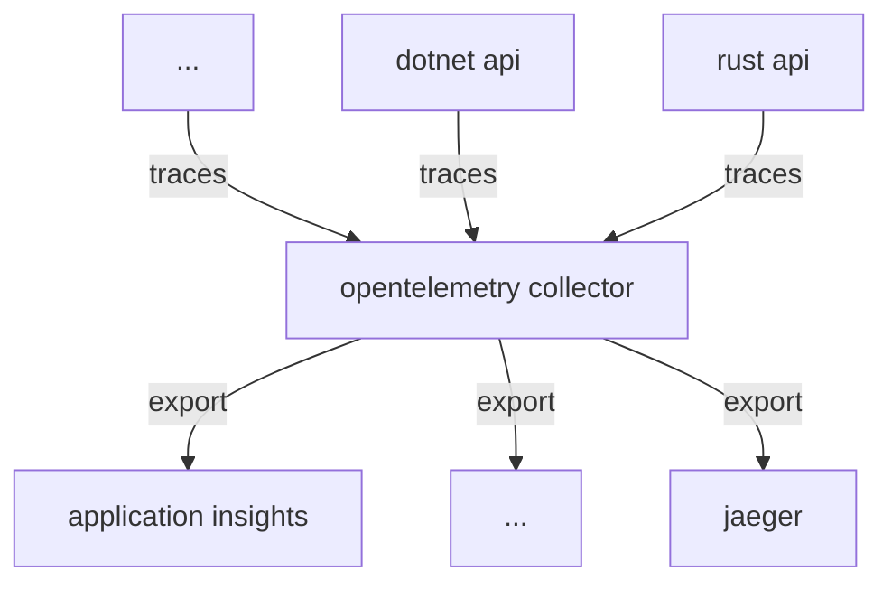

# POC OpenTelemetry

This repository serves as a POC for instrumenting applications with OpenTelemetry



## Run the example

```bash
docker compose up
```
## Implemented examples

- [x] Rust
- [x] Dotnet

## Work in progress

- [ ] React

## Useful links

